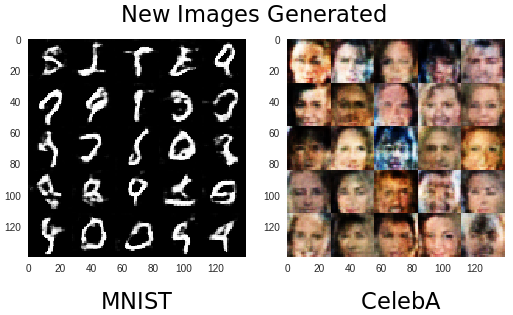

# Project: Face Generation
Udacity Deep Learning Nanodegree program 2019. In this project, I develop an algorithm to generate new images.

## Project Overview
In this project, I built a [deep convolutional generative adversarial network](https://arxiv.org/pdf/1511.06434.pdf) (DCGAN) that can generate new images. Furthermore, I use a method for visual analysis of a neural network is also know as _feature maximization_ or _activation maximization_, to more information see [paper 1](https://arxiv.org/pdf/1506.06579.pdf) and [paper 2](https://arxiv.org/pdf/1602.03616.pdf). The project is using DCGAN, but it was based on [GANs](https://papers.nips.cc/paper/5423-generative-adversarial-nets.pdf) propose by Goodfellow
 
  

    
  

 

The project there are seven steps:
- _Step 1:_ Explore the Data
  - MNIST
  - CelebA
- _Step 2:_ Build the Neural Network
  - Input Function
  - Discriminator Function
  - Generator Function
  - Loss Function
  - Function to Optimization
- _Step 3:_ Neural Network Training
- _Step 4:_ Generation of new images
  - MNIST
  - CelebA
- _Step 5:_ Visual Analysis*
  - MNIST
  - CelebA

The code is written in Python 3 and [Tensorflow](https://www.tensorflow.org/) all presented in Jupyter Notebook.

\*Step 5 was implemented by me. Thus it does not belong in the Udacity original project.

### Prerequisites
Thinks you have to install or installed on your working machine:

- Python 3
- Numpy
- OS
- Glob
- Tqdm
- Pickle
- Matplotlib
- Jupyter Notebook
- Tensorflow

## Jupyter Notebook
- `dlnd_face_generation.ipynb`

This jupyter notebook describe the whole project from udacity, from the beginning to the end.

## Download the Datasets
You do not worry about datasets. Because the notebook will download it for you, but if you know more about datasets see [MNIST](http://yann.lecun.com/exdb/mnist/) and [CelebA](http://mmlab.ie.cuhk.edu.hk/projects/CelebA.html)

## Running the project
The whole project is located in the file `dlnd_face_generation.ipynb` and it's include the training and the prediction part.
To open the project [click here](https://github.com/buzutilucas/face-generation/blob/master/dlnd_face_generation.ipynb)
